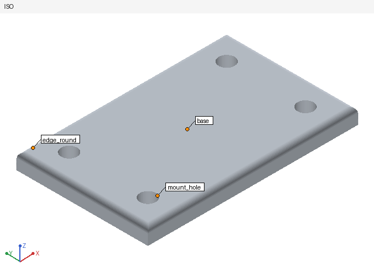
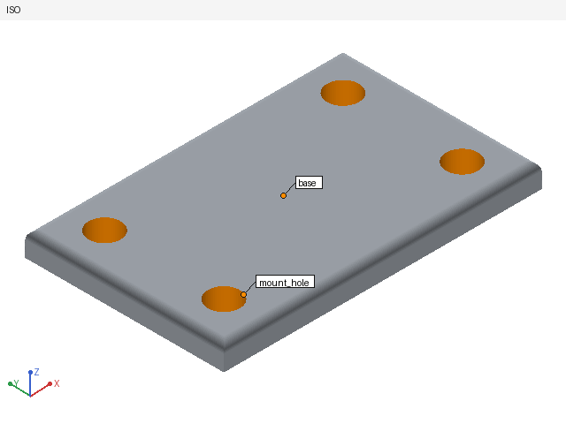
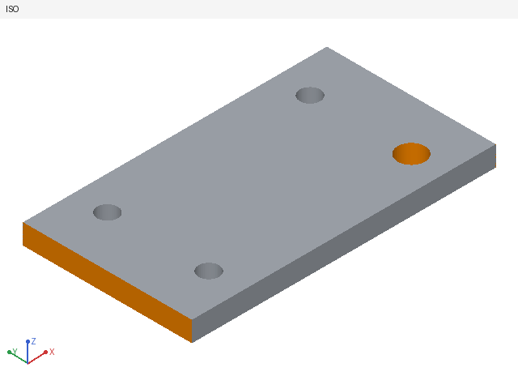

# FreeCAD part backend: implementation notes

This note records what was built for the plan "FreeCAD Part backend (one PR)", what was measured, and where the installed FreeCAD differs from the plan. The user-facing text is in `docs/installing-reify.md` and `skills/parametric-cad-modeling/references/freecad-part-ops.md`.

## Measured

| Item | Value |
|---|---|
| FreeCAD | 1.1.0 (conda-forge `freecad=1.1.0`, build snapshot `20260325`) |
| OpenCASCADE | 7.9.3 |
| Python in the FreeCAD environment | 3.11 |
| Disk use after install | 4.2 GB (4.1 GB environment + 18 MB micromamba; the download cache is cleaned) |
| Install time (`npm run setup:freecad`, fast network, Linux x86_64) | 41 s |
| Cold start (spawn worker, import FreeCAD, create a document) | 0.31 s |
| `worker.selftest` (Pad, Pocket, Fillet, STEP export) | 0.67 s including interpreter start |
| `part-apply`, first build (plate, 4 holes, fillet) with identity bind, geometry check, 7 renders, evidence | 5.5 s (includes the first start of the uv `cadctl` kernel) |
| `part-apply`, one edit, warm | 2.1 s (worker part about 0.15 s; the rest is bind, inspect and rendering) |
| `part-try`, warm | 1.7 s |
| `cad.model.build` (build123d), same part, for comparison | 1.3 to 1.6 s |
| Pose sweep, 33 samples with refine, two bodies | 0.35 s |

## What the views look like

Hole widened from 6 mm to 8 mm with one op, `{"op": "set", "target": "Params", "prop": "hole_d", "value": 8}`. Only the four hole walls are orange, `mount_hole` is labelled, and the first image's text says `volume -527.788 mm³`.

| Before (rev 1) | After (rev 2) |
|---|---|
|  |  |

The same feature with build123d: a wider plate and one bigger hole, rebuilt with `cad.model.build`. The new faces are orange and the summary reports the volume and bounding box change.

## Deviations from the plan

1. **micromamba comes from conda-forge**, not from `micro.mamba.pm`. The bootstrap script downloads `micromamba-2.9.0-0.tar.bz2` from the conda-forge channel and checks a pinned SHA-256. It is the same host that serves the FreeCAD packages, so one allowed host is enough.
2. **`FreeCAD.so` is in `<env>/lib`**, which is not on `sys.path`. `runtime.json` therefore has a `libPath` field, and the worker is started with `PYTHONPATH=<repo>/python:<libPath>`.
3. **Roles do not use FreeCAD's element map.** `getElementHistory` returns nothing for faces, and a mapped name changes when a later feature touches the face (a pad's top face after a hole is cut through it). Roles come from the geometry each feature defines: the faces a feature created are the faces of its result that are not inside a face of its base shape; a face of the final body belongs to a created face when both lie on one surface and the final face is inside it (`python/reify_freecad/roles.py`). `ROLE_FALLBACK_GEOMETRIC` is reported only when a role cannot be derived at all. The role-stability test records five edits (diameter, thickness, fillet, slot pocket) with the wall still the right cylinder.
4. **Rollback reloads the saved file** instead of `abortTransaction`. The disk file is the only trusted state. Transactions are still opened.
5. **The highlight shows new surfaces, not every touched face.** A plate that gains a hole keeps its top face grey; the hole wall is orange. `faces.new` and `faces.removed` still count every face whose fingerprint changed, with the rule of section 3.1. If more than 60% of the faces changed, nothing is coloured. Fingerprints carry one extra field, `ap` (a point on a cylinder or cone axis), for this.
6. **The identity selector grammar gained `axisPoint` and `bboxCenter`.** `centroid` of a curved face in cadctl is a parametric centre that depends on the seam. FreeCAD cannot reproduce it. See `docs/identity-protocol.md`.
7. **A `part-apply` that fails after the commit is undone.** If identity binding or the geometry check fails after the worker committed, the sidecar calls `undo` and reports `rolledBack: true`, so no half-applied revision remains.
8. **`part-open` of an existing document with geometry also builds and observes it**, so the Agent sees the model when it opens it. A document without geometry returns no images.
9. **Pose sweep views label the two parts** (centres of the two named bodies) instead of colouring them.
10. **No CJK label font.** The repository has none. Labels are ASCII; other characters become `?`.
11. **Not changed**: the desktop activity cards. A `doc.apply(...)` call shows as a generic Python card with its images.

## Version checks (plan section 7)

1. `App::VarSet` works. Dynamic properties (`ReifyPath`, the `Params` attributes, requirement fields) are stored in the `.FCStd` and survive a reopen (`test_the_document_reopens_with_the_same_model`).
2. Sketch properties `DoF`, `ConflictingConstraints`, `RedundantConstraints`, `MalformedConstraints` and `solve()` exist as named. Constraint expressions need units: `Params.w - 3` fails with a unit mismatch, so generated expressions write `3 mm`, and an `=expression` the user writes without units is reported as `EXPRESSION_INVALID` with a hint.
3. `ElementMap`, `ElementReverseMap` and `getElementHistory` exist, but see deviation 3.
4. `PartDesign::Hole`: `Diameter`, `Depth`, `DepthType` (`Dimension`, `ThroughAll`), `Threaded`, `ThreadType`, `ThreadSize` (spelled `M6x1`, so `M6` is expanded), `HoleCutType` (`Counterbore`, `Countersink`), `DrillPoint` (default angled, so a cone is a countersink only when the hole has one).
5. `import PartDesign` needs no GUI.
6. `openTransaction`, `commitTransaction` and `abortTransaction` work headless with `UndoMode = 1`.

Other differences that cost time:

- Features and sketches inside a body are in the body's local frame; only `Body.Shape` carries the pose. Roles are found in the local frame and moved to world coordinates by the body placement.
- A pattern must be added to the body after `Originals` is set (`doc.addObject`, then `body.addObject`). With `body.newObject` the body does not move its Tip to the pattern.
- `Pad.Type` values: `Length`, `UpToLast`, `UpToFirst`, `UpToFace`; `Pocket.Type` has `ThroughAll`.
- There is no `isTouched()`. "Recomputed" comes from a document observer that sees `Shape` assigned during `recompute()`. FreeCAD touches every object that references the `Params` object when one parameter changes, so `features.recomputed` lists those objects, not only the ones whose value changed.
- A body's single solid can come wrapped in a compound, which has no `CenterOfMass`; queries unwrap it.
- The conda-forge `freecad` package has newer weekly builds (`2026.09.16`). The environment pins `1.1.0`.

## Not verified here

- **osx-arm64.** The lock file was solved on Linux (`CONDA_OVERRIDE_OSX=11.0`) and has not been installed on a Mac. The default macOS install path contains a space (`Application Support`); conda environments in paths with spaces can break scripts with shebang lines. If the install fails there, set `PI_CAD_FREECAD_HOME` to a path without spaces.
- **Desktop manual demo** (acceptance item 4) was done through the Agent API, not through the Reify desktop window.

## Tests

| Where | What | Needs FreeCAD |
|---|---|---|
| `tests/test_reify_freecad_pure.py` | op schema, shared path vectors with cadctl, expressions, error mapping, no FreeCAD import in pure modules | no |
| `tests/freecad/` (34 tests) | nine features, recompute scope, rollback, conflicts, role stability, undo, pose sweep, budget, requirements, the examples in the reference document | yes |
| `tests/freecad-worker.test.ts` | worker bridge with a fake worker: order, timeout kill, restart and reopen, errors, abort | no |
| `tests/part-ops-authorization.test.ts` | `model.build` versus `probe.run`, read-only author, reviewer | no |
| `tests/part-e2e.test.ts` | open, build, edit, resolve the named hole, try, failing fillet, budget kill, undo | yes (skipped otherwise) |
| `tests/build-changes.test.ts`, `tests/test_face_fingerprints.py`, `tests/test_render_highlight.py`, `tests/test_bind_identity.py` | change summary, fingerprints (shared vectors), render highlight and labels (pixel-identical without them), identity binding | no |

Run the FreeCAD tests with `PYTHONPATH=python:<env>/lib <env>/bin/python -m unittest discover -s tests/freecad`.
