# Pi-CAD 白皮书

**Harness-native Agentic Mechanical CAD on Pi**  
**版本：0.1 / Architecture Proposal**  
**日期：2026-08-17**

---

## 摘要

Pi-CAD 的目标不是再写一版更长的 `cad-skill`，也不是重新实现一个 CAD Agent Runtime。它要把旧 `cad-skill` 已经验证过的机械工程能力，从 Markdown 指令迁移到一个 **由 Pi 承载 Agent、由 Harness 强制流程、由纯工具暴露现实、由 Agent 独立解释工程语义** 的系统中。

本白皮书冻结以下五条设计公理：

1. **Tools expose reality.** 工具只读、写、比较、渲染、计算、求解；它们不解释工程意义。
2. **Agent interprets reality.** 只有 Agent 负责理解用户、理解 CAD、形成假设、做工程判断、选择方案和解释结果。
3. **Workflow defines process.** 工作流只定义阶段、允许动作、必需的程序性证据和合法转移。
4. **Harness enforces workflow.** Harness 管状态、权限、自动动作、恢复、版本和继续运行，不替 Agent 做工程推理。
5. **Skills improve reasoning.** Skill 只保存机械设计、build123d、接口、制造、仿真等知识，不再承担流程强制。

目标架构保留旧 `cad-skill` 的能力边界：快速直接建模、Greenfield、Legacy 理解与受控修改、装配与接口闭合、格式/层级转换、3D-print-to-CNC、物理驱动设计、工程图、仿真质量、制造审查、Release Package、产品渲染与动画。区别只在于：这些能力不再依赖同一个 Agent 记住几十条规则并手工编排所有命令。

---

# 1. 背景：旧 `cad-skill` 已经不再是一个 Skill

旧 `cad-skill` 的演化来自真实失败。它不是从理论上堆规则，而是在 reverse CAD、STL→STEP、光学结构、风路设计、装配转换、生产交付等任务中不断修补系统性错误。

最终，它实际上包含五套叠加系统：

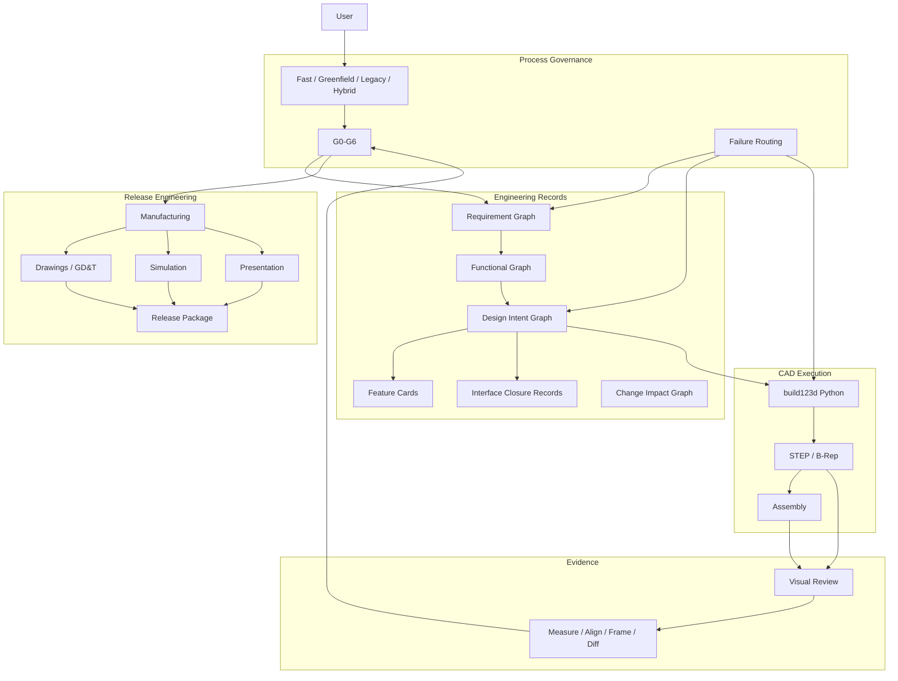

## 1.1 旧 Skill 的核心价值

以下设计必须保留：

- 任务类型、允许修改范围、fidelity、maturity 和 authoritative artifact 的显式绑定；
- Greenfield 与 Legacy 的不同路径；
- 对复杂 Greenfield 先做需求、功能、架构，再做 CAD；
- 对 Legacy 先看原生坐标系、视图和剖面，再做测量和修改；
- 设计意图、datum、interface、load path、manufacturing intent 的显式表达；
- Interface Closure：接触、孔对齐或零距离不能等同于真实连接成立；
- Visual-first：视觉负责形成空间问题，确定性工具负责回答明确几何问题；
- independent evidence：不能用生成器自己的常量给自己证明正确；
- change/evidence invalidation：只重跑受当前变化影响的证据；
- drawing、simulation、presentation 都有独立质量门槛；
- release/production 请求会主动展开完整产品工程工作流，而不是只交 STEP。

## 1.2 旧 Skill 的结构性问题

旧系统概念上有状态机，运行时却没有真正的状态机。

真正的执行方式是：

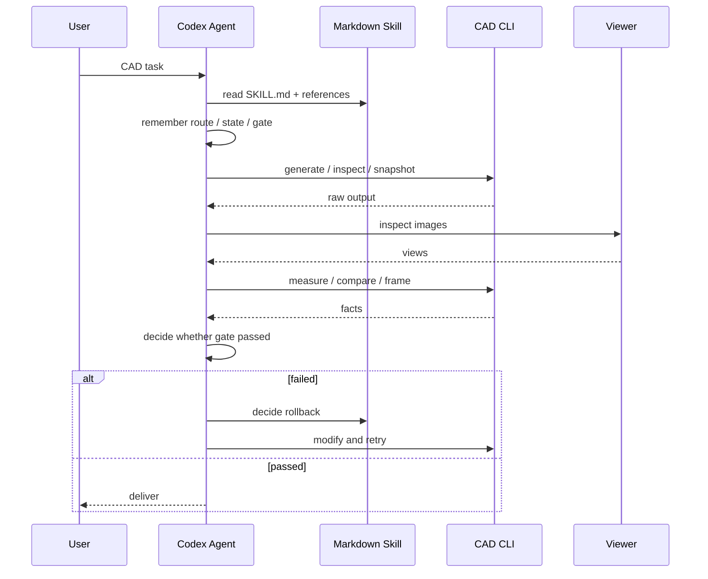

所以同一个 Agent 同时承担：

- 机械工程师；
- 需求工程师；
- workflow engine；
- state store；
- tool orchestrator；
- QA manager；
- release manager。

失败后的自然反应是继续向 `SKILL.md` 加规则。长期结果是 instruction accretion：方法论越来越正确，但执行越来越重、越来越慢、越来越依赖 Agent 对长指令的完美遵循。

---

# 2. CADAM 的启发：真正有价值的是 Harness Loop

CADAM 的工程设计深度有限，但它实现了一条非常有效的 Agent Harness。

它的参数化流程核心只有两个显式动作：

```text
build_parametric_model
answer_user
```

第一次参数化 turn 会尽量强制进入 `build_parametric_model`；生成的 OpenSCAD 在浏览器内通过 OpenSCAD WASM 编译，得到几何并生成多视图；工具结果重新进入模型上下文，随后自动继续下一轮。整个 loop 不是由 Agent 口头记忆，而是由运行时强制。

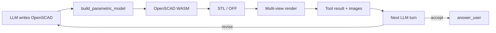

## 2.1 Pi-CAD 要直接借鉴的四件事

1. **Forced protocol**：Build 与 Finish 是显式动作，不是自然语言宣称。
2. **Tool-owned execution**：提交 candidate 后，必然执行的 build/render/inspect 由 Harness 自动做。
3. **Observation feedback**：真实执行结果自动回注 Agent。
4. **Automatic continuation**：如果流程未完成，Harness 可以主动触发下一轮。

## 2.2 Pi-CAD 不借鉴的东西

CADAM 的主要 feedback 是视觉，因此它容易优化成 “CAD-shaped plausibility”：模型越来越像用户说的东西，但并不自动具备传动、流体、强度、制造等工程意义。

Pi-CAD 不引入“万能 Verifier”来解决这个问题。不存在一个工具可以对任意 STEP 自动推导其真实工程语义。Pi-CAD 的答案是：**语义只由 Agent 解释；工具只提供确定性事实。**

---

# 3. 为什么选 Pi

Pi 已经提供我们真正需要的 Agent Runtime：

- agent/session 生命周期；
- custom tools；
- `before_agent_start` 和 `context` 注入；
- `tool_call` 拦截和参数修改；
- `tool_result` 拦截；
- 动态 `setActiveTools()`；
- `sendUserMessage()` / `sendMessage()` 自动续跑；
- `appendEntry()` session 持久化；
- custom UI；
- `pi.events` extension 间事件总线；
- package 可以同时发布 extensions、skills、prompts 和 themes。

因此 Pi-CAD 不需要重新实现：模型管理、上下文、工具循环、session tree、TUI、compaction 和基础文件操作。

Pi-CAD 只实现机械工程领域真正有差异化的部分：

```text
CAD workflow + deterministic capabilities + engineering prompt/state + evidence/version control
```

---

# 4. 架构公理

## 4.1 Tool 是确定性能力，不是 Engineer

工具只允许做以下事情：

- 读；
- 写；
- 转换；
- 渲染；
- 测量；
- 比较；
- 按明确输入运行求解器；
- 返回执行结果。

允许：

```text
inspect_visual(part.step)
measure(face_a, face_b)
compare_geometry(v1.step, v2.step)
run_fea(spec.json)
```

禁止：

```text
understand_part(part.step)
is_good_design(part.step)
identify_mounting_interface(part.step)
is_manufacturable(part.step)
verify_gearbox(part.step)
```

工具可以说：“圆柱面直径为 20 mm”。

工具不能说：“这是输出轴”。

## 4.2 Agent 是唯一语义解释者

Agent 负责：

- 理解用户真实目标；
- grilling；
- routing；
- 解释 CAD 视图；
- 判断几何特征的工程意义；
- 选择 architecture；
- 决定还需要量什么、看什么、算什么；
- 判断一个计算或仿真结果意味着什么；
- 判断是否修改、回滚或继续；
- 向用户解释结论和不确定性。

## 4.3 Harness 只管程序性正确性

Harness 可以强制：

- Analyze workflow 禁止修改文件；
- Baseline 状态离开前必须真的看过当前 artifact 的视图；
- candidate source 改变后自动重新 build；
- candidate hash 改变后旧 snapshot 被标记 stale；
- Review 前自动生成 current candidate 的 views 和 geometry facts；
- Finish 前必须存在 current artifact；
- workflow 未结束时自动续跑。

Harness 不可以判断：

- “Agent 是否真的理解了安装接口”；
- “这个机构设计是否聪明”；
- “这个 stress plot 是否证明安全”；
- “这个孔是不是定位孔”。

## 4.4 Workflow 是状态图，不是 Prompt 文档

Workflow 定义：

```text
states
transitions
allowed tool groups
entry actions
procedural guards
state-specific prompt
```

## 4.5 Skill 只保存知识

例如：

```text
build123d modeling patterns
mechanism design
interface design
GD&T
DFM
optics
fluid mechanics
simulation practice
presentation practice
```

Skill 不再规定 “先做 G1 再做 G2”。

---

# 5. 能力等价契约：新架构不得丢失旧 `cad-skill` 能力

“能力等价”指目标架构必须覆盖旧 `cad-skill` 的能力边界；Walking Skeleton 不要求第一天全部实现，但任何旧能力都必须有明确的新归属。

| 旧 `cad-skill` 能力 | Pi-CAD 归属 |
|---|---|
| fully specified 快速零件 | Quick workflow + geometry tools |
| Greenfield mechanical design | Greenfield workflow + requirements grilling + engineering skills |
| Legacy STEP/CAD 理解 | Analyze/Modify baseline states + visual/geometry tools |
| controlled redesign | Modify workflow + artifact versioning + compare tools |
| 3D-print → CNC redesign | Modify/Hybrid workflow + manufacturing skill/tools |
| part orthographic / section review | `inspect_visual` / `inspect_section` |
| fit-critical assembly | Assembly subflow + views/measure/frame/interference tools |
| optics/airflow/structural/thermal concept work | Greenfield optional domain-analysis state + solver tools + domain skills |
| interface closure | Agent-authored interface records + plan/review prompts |
| seal / preload stack review | Agent reasoning + measure/calc/simulation tools |
| hierarchy-safe assembly conversion | Convert workflow + assembly tree + transforms + matched views |
| engineering drawings / GD&T | Release workstream + drawing tools + drawing skill |
| simulation quality | Simulation workstream + solver tools + simulation skill |
| DFM / manufacturing readiness | Release/Modify review + manufacturing skill + deterministic geometry facts |
| controlled rendering / animation | Presentation workstream + render tools + presentation skill |
| parameterized build123d / STEP-first | geometry backend |
| Requirement Graph | structured requirements record maintained by Agent |
| Functional / Design Intent Graph | Agent reasoning artifacts / plan record |
| Feature Cards | optional Agent-authored design records |
| Interface Closure Record | Agent-authored record, required by applicable state prompt |
| Change Impact / evidence invalidation | Harness version/evidence dependency logic |
| G0-G6 | decomposed into workflow states and human acceptance |
| Visual / Mechanical / CAD critics | Agent review prompts / optional critic passes, not hidden models in tools |
| release matrix | Release workflow workstreams |

---

# 6. Pi-CAD 总体架构

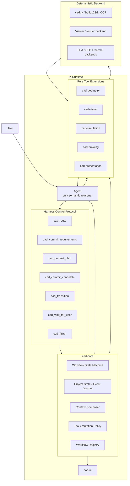

## 6.1 两套“Tool Call”必须概念分离

### Engineering Capability

它们操作现实：

```text
cad_build_step
cad_inspect_visual
cad_inspect_geometry
cad_inspect_section
cad_measure
cad_compare_geometry
cad_assembly_tree
cad_export
cad_run_simulation
...
```

### Harness Control Protocol

它们操作流程：

```text
cad_route
cad_commit_requirements
cad_commit_plan
cad_commit_candidate
cad_transition
cad_wait_for_user
cad_finish
```

两者在 Pi 中都可能表现为 `registerTool()`，但前者是“工程工具”，后者是“Agent 与状态机的协议”。

---

# 7. Canonical State 与 Evidence

Pi transcript 不应成为唯一工程事实源。Session 可以 fork、compact、resume；工程状态需要绑定项目与 artifact 版本。

建议项目目录：

```text
.pi-cad/
├── task.json
├── state.json
├── events.jsonl
├── records/
│   ├── requirements.json
│   ├── plan.json
│   ├── interfaces.json
│   └── release.json
├── evidence/
│   ├── visual/
│   ├── geometry/
│   ├── compare/
│   └── simulation/
└── artifacts/
    └── manifest.json
```

## 7.1 最小 State Schema

```ts
type CadProjectState = {
  taskId: string;
  workflow: string | null;
  phase: string;
  status: "active" | "waiting_user" | "ready" | "done" | "aborted";

  maturity: "review" | "concept" | "prototype" | "engineering" | "manufacturing" | "release";
  mutationPolicy: "read_only" | "source_only" | "allowed";

  requirementsVersion?: string;
  planVersion?: string;
  currentSourceHash?: string;
  currentArtifactHash?: string;

  evidence: EvidenceRef[];
  staleEvidence: EvidenceRef[];
  activeWorkstreams: string[];
};
```

这些字段描述流程状态，不包含“这个零件是电机支架”之类语义。

## 7.2 Lightweight Event Journal

所有关键变更记录：

```text
CadStarted
WorkflowRouted
RequirementsCommitted
PlanCommitted
SourceChanged
CandidateCommitted
ArtifactBuilt
EvidenceCreated
TransitionRequested
UserInputRequested
WorkflowReady
Finished
```

这样可以恢复、调试、回放和测试状态机。

---

# 8. 纯工具体系

所有工具统一返回 envelope：

```ts
type ToolEnvelope<T> = {
  ok: boolean;
  tool: string;
  toolVersion: string;
  backendVersion?: string;
  inputHashes: Record<string, string>;
  outputHashes: Record<string, string>;
  durationMs: number;
  warnings: string[];
  artifacts: Array<{ path: string; kind: string; sha256: string }>;
  payload: T;
};
```

这保证证据可绑定版本、可缓存、可失效。

## 8.1 `cad_build_step`

**用途：** 执行 source，生成 STEP 和可选 sidecars。  
**语义：** 无。

输入：

```json
{
  "source": "models/gearbox.py",
  "output": "build/gearbox.step",
  "sidecars": ["glb"],
  "force": false
}
```

输出 payload：

```json
{
  "step": "build/gearbox.step",
  "sidecars": ["build/gearbox.glb"],
  "exitCode": 0,
  "stdout": "...",
  "stderr": "..."
}
```

## 8.2 `cad_inspect_visual`

**用途：** 返回当前 artifact 的固定视图。  
**默认：** `iso/front/back/left/right/top/bottom`。  
**禁止：** 输出 “这是减速器”“这里是安装接口”。

输入：

```json
{
  "artifact": "build/gearbox.step",
  "views": ["iso", "front", "back", "left", "right", "top", "bottom"],
  "display": "solid",
  "labels": false
}
```

输出：

```json
{
  "views": [
    {"name":"iso","path":"evidence/iso.png","camera":{...}},
    {"name":"front","path":"evidence/front.png","camera":{...}}
  ],
  "units": "mm",
  "bbox": [220.0, 180.0, 160.0],
  "occurrenceCount": 17,
  "solidCount": 21
}
```

Pi tool result 同时附带图片内容，使 Agent 可以直接视觉理解。

## 8.3 `cad_inspect_geometry`

返回可由 STEP/B-Rep 直接确定的事实：

```json
{
  "units":"mm",
  "bbox":{"x":220,"y":180,"z":160},
  "volume":123456.7,
  "surfaceArea":45678.0,
  "solidCount":21,
  "occurrences":[...],
  "labels":[...],
  "planes":[...],
  "cylinders":[...]
}
```

`planes/cylinders` 是几何分类，不得被命名为 “mounting_face” 或 “shaft”。

## 8.4 `cad_inspect_section`

输入显式 section plane：

```json
{
  "artifact":"part.step",
  "origin":[0,0,30],
  "normal":[1,0,0],
  "display":"hidden_edges"
}
```

输出 section image、intersection curves、截面几何统计。

## 8.5 `cad_measure`

Agent 明确指定 selector 和 metric。

```json
{
  "artifact":"part.step",
  "metric":"distance",
  "a":"#f12",
  "b":"#f34"
}
```

支持：

```text
distance
angle
radius
diameter
area
volume
clearance
alignment_delta
frame
```

工具只返回数值和坐标。

## 8.6 `cad_compare_geometry`

输入两个 artifact 和显式坐标变换（若需要）：

```json
{
  "before":"v1.step",
  "after":"v2.step",
  "transformBefore":null,
  "transformAfter":null,
  "metrics":["bbox","volume","occurrence_tree","surface_delta"]
}
```

输出纯 diff：数量、尺寸、变换矩阵、几何差异文件。

## 8.7 `cad_assembly_tree`

输出：

- occurrence labels；
- parent/child；
- local transform；
- world transform；
- source file；
- leaf count。

不解释哪个 occurrence 是 motor、bearing 或 carrier，除非源文件本身已有该 label。

## 8.8 `cad_export`

输入明确 source/format/config，输出 STEP/STL/3MF/GLB/DXF 等，以及 manifest。

## 8.9 `cad_run_simulation`（可选插件）

输入完整 spec：

```json
{
  "artifact":"frame.step",
  "solver":"calculix",
  "analysis":"static",
  "materials":"spec/materials.json",
  "loads":"spec/loads.json",
  "constraints":"spec/bc.json",
  "mesh":"spec/mesh.json"
}
```

输出 solver log、mesh stats、reaction、field files、plots、convergence data。

**绝不输出：** “安全”“合格”“可发布”。

## 8.10 Drawing / Presentation Tools

同样遵循 spec-driven deterministic pattern：

```text
cad_generate_drawing(drawing_spec.json)
cad_render_scene(visual_spec.json)
cad_package_release(package_spec.json)
```

工具保证按 spec 执行；Agent 负责定义 spec 和解释结果。

---

# 9. Harness Control Protocol

## 9.1 `cad_route`

Agent 在 `intake` 中显式选择 workflow：

```json
{
  "workflow":"modify",
  "reason":"User supplied an existing STEP and authorized geometry changes."
}
```

第一版支持：

```text
quick
analyze
modify
greenfield
hybrid
convert
release
```

Routing 是 Agent 的语义判断，Harness 只验证 route 名称是否合法。

## 9.2 `cad_commit_requirements`

提交当前 maturity 下已经达到 shared understanding 的 working brief。

```json
{
  "goal":"Reduce housing height by 20 mm.",
  "deliverables":["STEP","source"],
  "must":[
    "preserve four base-hole positions",
    "preserve motor interface"
  ],
  "preferences":[],
  "assumptions":["material unchanged"],
  "openUnknowns":[],
  "maturity":"prototype"
}
```

Harness 只检查 schema，不判断这些语义是否聪明。

## 9.3 `cad_commit_plan`

对非 Quick workflow 提交计划/设计意图：

```json
{
  "summary":"Shorten upper housing while retaining lower interfaces.",
  "protected": ["base-hole pattern", "motor interface"],
  "plannedChanges": ["upper wall height"],
  "interfaces": [...],
  "datums": [...],
  "reviewPlan": ["compare old/new", "inspect side section"]
}
```

Greenfield 还可以包含候选架构和 selection rationale。

## 9.4 `cad_commit_candidate`

这是 Pi-CAD 对 CADAM `build_parametric_model` 的对应物。

Agent 只提交 source：

```json
{
  "sources":["models/gearbox.py"],
  "label":"candidate-v3"
}
```

随后 Harness 自动执行当前 workflow 定义的 entry actions，例如：

```text
build_step
→ inspect_visual
→ inspect_geometry
→ compare_geometry (Modify only)
→ enter review
→ automatically continue Agent
```

## 9.5 `cad_transition`

Agent 显式表达自己的工程判断：

```json
{
  "event":"baseline_understood",
  "note":"I have inspected the current views and measured the critical hole pattern."
}
```

Harness 只检查程序性 guard，例如当前 artifact hash 是否确实存在 current visual evidence。

## 9.6 `cad_wait_for_user`

当 Agent 判断某个决策必须由用户做：

```json
{
  "reason":"Output torque is required before selecting gearbox architecture."
}
```

状态进入 `waiting_user`；用户回复后恢复原 phase。

## 9.7 `cad_finish`

Agent 请求结束。Harness 检查：

- workflow 已进入 `ready`；
- current artifact/source 存在；
- 必需 entry actions 对 current hashes 已完成；
- 没有 pending tool execution；
- release workflow 的结构性 workstream 状态已闭合/NA/blocked。

Harness 不判断设计本身“好不好”。

---

# 10. Prompt Engineering

Pi-CAD 不再使用一个 20k+ 的永驻 CAD system prompt。

Prompt 采用分层组合：

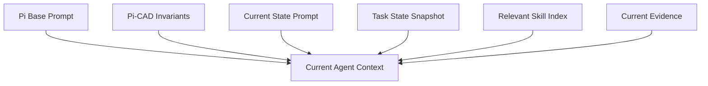

## 10.1 永驻 Invariant Prompt

建议控制在数百 token：

```text
You are the semantic engineering reasoner inside Pi-CAD.

Tools expose deterministic facts or execute explicit operations. Never treat a tool as an engineering interpreter.
You are responsible for understanding the user's intent, interpreting CAD geometry and images, making engineering decisions, and explaining uncertainty.
The current Pi-CAD workflow state is authoritative. Use cad_* control actions to route and transition; do not bypass the workflow by merely claiming completion.
Do not claim that you inspected, measured, simulated, compared, or built something unless the current state contains a corresponding result for the current artifact version.
When a fact can be obtained from available files or deterministic tools, inspect it instead of asking the user.
User decisions remain user decisions. When a missing decision materially affects the design, ask rather than silently inventing it.
```

## 10.2 Requirements / Grilling Prompt

这里吸收 Matt Pocock `grill-me / grilling` 最有价值的交互纪律：

- 一次只问一个问题；
- 每个问题附带 Agent 自己的推荐答案；
- 能从项目、文件、CAD、工具里查到的事实先查，不拿去问用户；
- 沿决策依赖顺序向下问，上游问题先解决；
- 在 shared understanding 形成前不进入执行。

建议 prompt：

```text
Current state: REQUIREMENTS.

Your job is to reach a shared, actionable understanding for the requested maturity before execution begins.

Work down the decision tree one dependency at a time. Ask exactly one user question per turn when a user decision is required.
For each question, give your recommended answer and briefly state the consequence of choosing it.
Before asking, use available files and deterministic CAD tools if they can answer the factual part yourself.
Resolve high-impact upstream decisions before downstream details.
Do not grill for information that does not affect the requested maturity or next meaningful design decision.
Keep explicit assumptions reversible and visible.
When you believe the task is sufficiently defined, call cad_commit_requirements instead of starting CAD work directly.
```

## 10.3 Intake Prompt

```text
Current state: INTAKE.
Understand the user's requested action and available artifacts.
You may inspect files or existing CAD if that is needed to choose a route.
Do not modify engineering artifacts in this state.
Choose one workflow by calling cad_route: quick, analyze, modify, greenfield, hybrid, convert, or release.
Routing is your semantic decision; explain the reason in the control action.
```

## 10.4 Baseline Prompt

```text
Current state: BASELINE.
The harness has attached current visual and geometric evidence for the authoritative artifact.
Interpret the geometry yourself. Tool output contains facts, not design meaning.
Use targeted section/measure/frame tools when your spatial hypothesis needs confirmation.
Do not modify the source or artifact in this state.
When you have enough understanding to plan the requested action, call cad_transition("baseline_understood").
```

## 10.5 Greenfield Concept Prompt

```text
Current state: CONCEPT.
Do not start detailed CAD yet.
Use the committed requirements to identify architecture variables, functional paths, interfaces, load/motion/energy paths, and domain constraints.
For a non-trivial system, compare at least two structurally different architectures unless the constraints genuinely leave one credible option; if so, record why.
Use drawings, calculations, references, or simple prototypes when they answer a design question. Treat generated visuals as hypotheses, not hidden geometry facts.
Only transition to INTENT when the chosen direction is explainable and its unresolved risks are explicit.
```

## 10.6 Review Prompt

```text
Current state: REVIEW.
The harness has built the current source and attached current-version visual and geometric evidence. In modification workflows it may also attach a deterministic before/after diff.
Interpret the result yourself.
Use targeted tools for any question that can be answered by measurement, section, geometry comparison, assembly transforms, or an explicit solver run.
Do not accept the candidate because it compiled or looks plausible.
If the issue is local geometry, revise the source and commit another candidate.
If the problem is upstream architecture or intent, transition back to the appropriate state.
If the candidate satisfies your engineering judgment at the requested maturity, request the workflow's acceptance transition.
```

## 10.7 Release Prompt

Release state prompts保留旧 `cad-skill` 的核心纪律：drawing、simulation、manufacturing、quality、configuration、presentation 是独立 workstreams；缺外部输入会降低 release status，但不应阻塞可以独立完成的工作；不能把 attractive plot、projection-only drawing 或 default render 冒充 release evidence。

---

# 11. State Machine

## 11.1 Global Machine

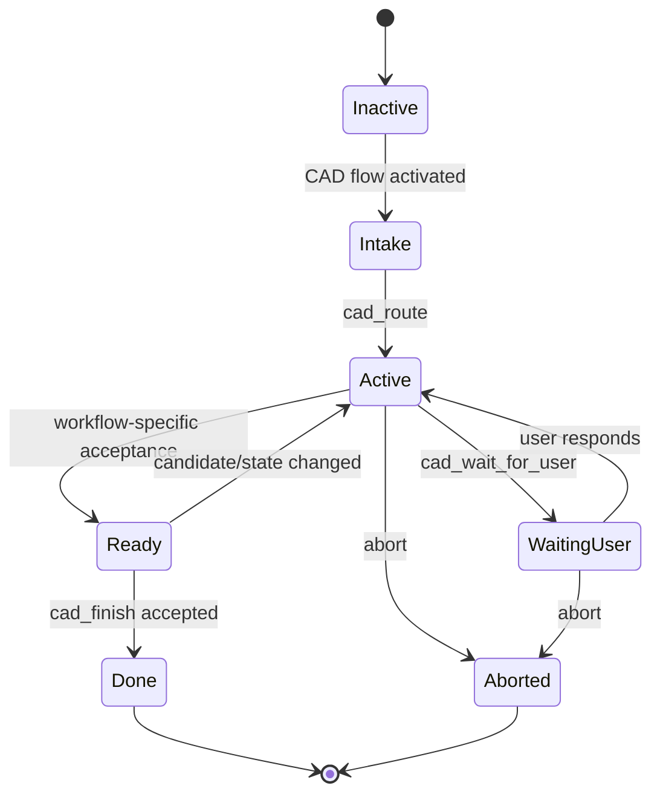

Global state 极少。复杂度放在 workflow-local states。

## 11.2 State Definition

```ts
type StateSpec = {
  id: string;
  prompt: string;
  activeToolGroups: string[];
  mutationPolicy: "read_only" | "source_only" | "allowed";
  entryActions?: AutoAction[];
  transitions: Record<string, string>;
  guards?: ProceduralGuard[];
};
```

Guard 只能检查程序性事实：

```text
current visual evidence exists for artifact hash
requirements record exists
candidate source exists
build succeeded
no pending tool call
release workstream status field is set
```

禁止：

```text
interface_is_correct
mechanism_is_good
simulation_proves_safe
```

---

# 12. Workflow Definitions

## 12.1 Quick

适用于 fully specified direct geometry、简单 edit、measurement、export、artifact regeneration。

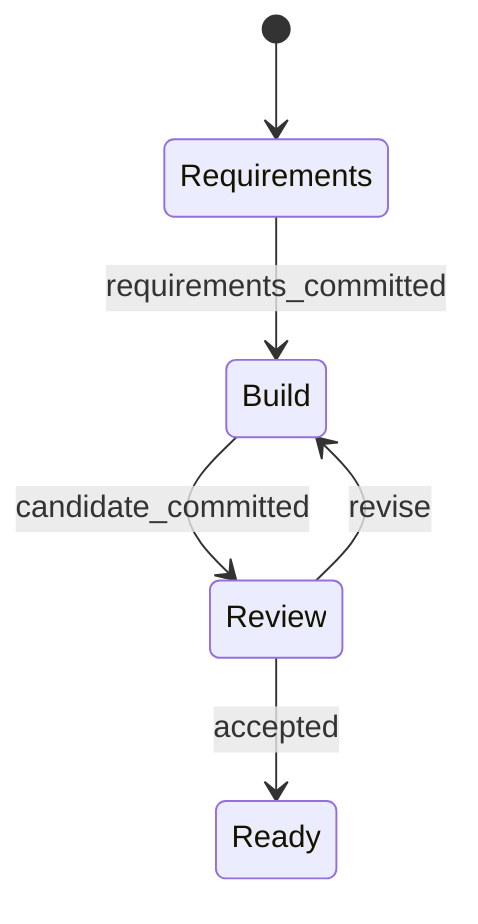

要求轻量，不强制复杂架构记录。

## 12.2 Analyze

全程 read-only。

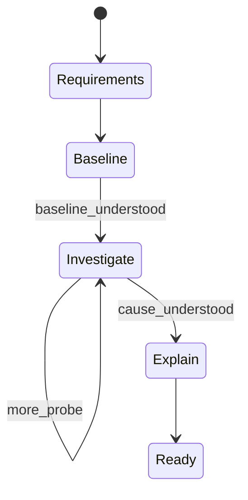

Harness 在此 workflow 中阻止 Pi `write/edit` 和 CAD mutation tools。

## 12.3 Modify

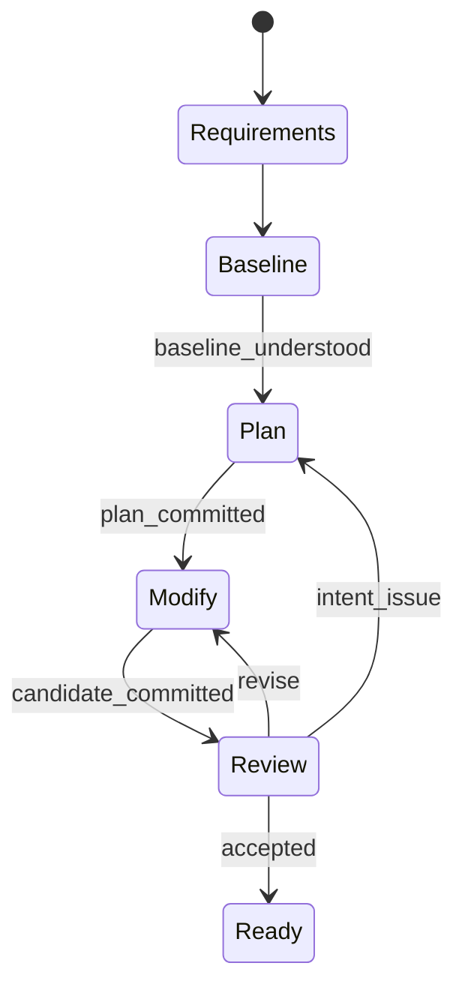

`Baseline` 自动触发原件 `inspect_visual + inspect_geometry`；`Review` 自动触发新件 build + current visual/geometry + deterministic diff。

## 12.4 Greenfield

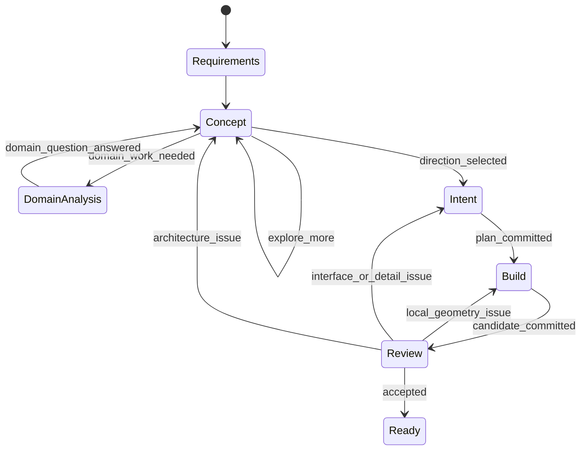

是否进入 `DomainAnalysis` 由 Agent 判断并显式 transition；Harness 不自己猜任务是不是流体/光学问题。

## 12.5 Hybrid

保留旧 Skill 的能力：已有接口按 Legacy baseline 处理，自由模块按 Greenfield concept 处理，随后在 Plan/Intent 汇合。

## 12.6 Convert

用于 STEP/GLB/Blender、nested assembly、mesh→analytic B-Rep、格式/层级转换等。

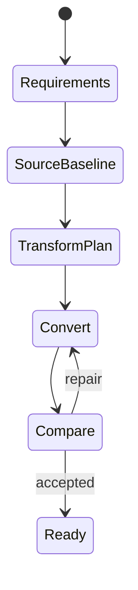

`Compare` 自动准备 source/converted assembly tree、world transforms 和 matched views；Agent 解释结果。

## 12.7 Release

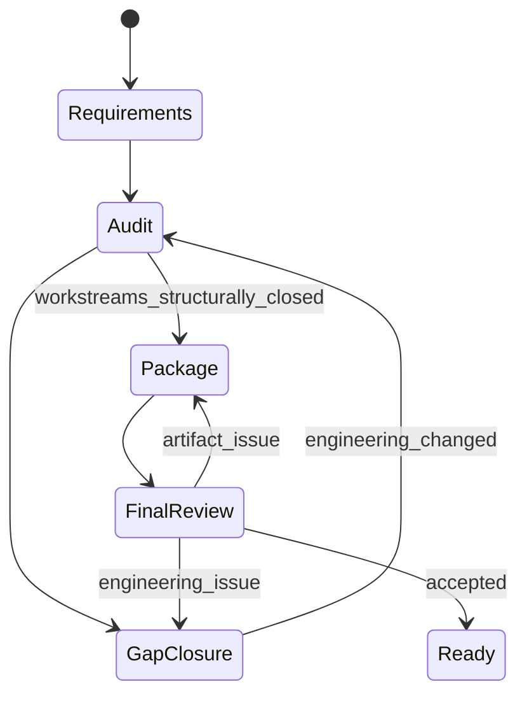

Release 维护独立 workstream 状态：

```text
design_definition
manufacturing_definition
bom
assembly_service
inspection_acceptance
engineering_analysis
risk_quality
configuration
presentation
```

每一项结构状态只能是：

```text
open
complete
not_applicable
blocked_external
```

Agent 决定语义状态，Harness 要求每一项在 Finish 前有明确状态和当前版本绑定。

---

# 13. 自动动作与 Agent 动作的边界

最重要的 inner loop：

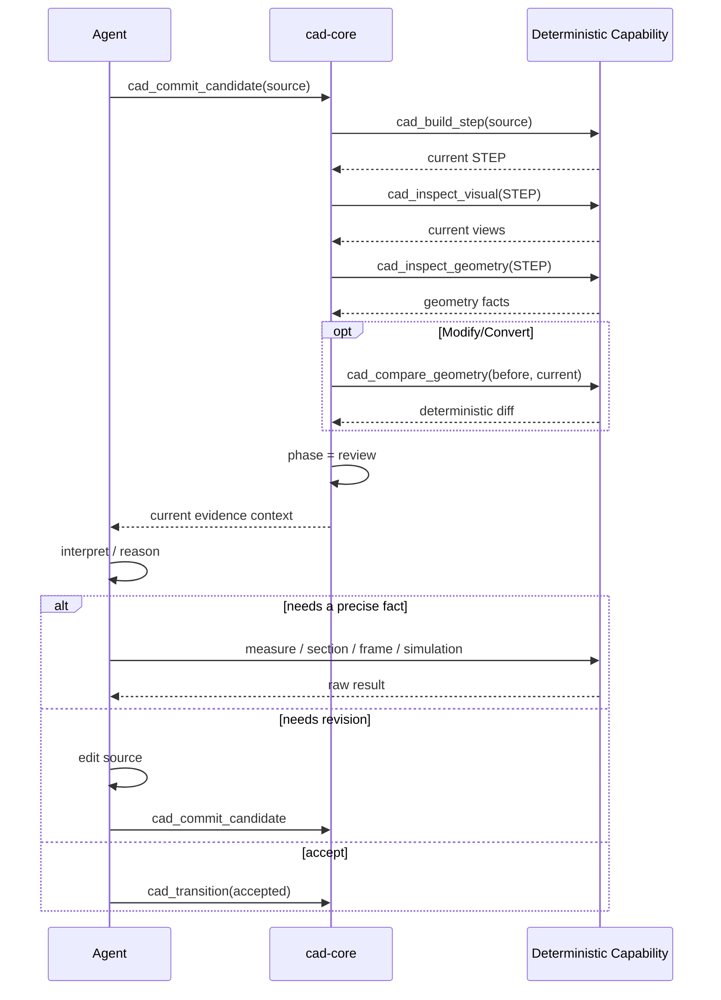

Harness 自动做的是 “candidate 一旦变化就必然应该发生的机械动作”。

Agent 保留所有意义判断。

---

# 14. 故事化用户旅程

## 14.1 早上 9:15：快速出一个打印件

用户说：

> “做一个 100 × 80 × 5 mm 的安装板，四角 6 mm 通孔，孔心距边 10 mm，给我 STEP。”

Pi-CAD 进入 Intake。Agent 判断这是 Quick，调用 `cad_route(quick)`。

Requirements 状态中没有必要开一场长会。参数已经足够明确，Agent 直接 `cad_commit_requirements`。

Agent 写 `model.py`，调用 `cad_commit_candidate`。此时用户不再看到 Agent 手工运行五个 CLI：Harness 自动 build STEP、生成七视图和 geometry summary，再把结果交回 Agent。

Agent 看 top view，发现四孔阵列正确；调用一次 `cad_measure` 检查孔径与孔心；确认后 transition 到 Ready，再 `cad_finish`。

用户体验只有：

```text
需求 → 生成 → 自动检查 → STEP
```

## 14.2 上午 10:40：改一个现有电机支架

用户拖入 `old_mount.step`：

> “这个支架太高了，整体降 20 mm，但原来的电机和底板都要继续装。”

Agent route 到 Modify。

Requirements 状态开始 grilling。它不会一次扔十个问题，而是先问最关键的：

> “我的建议是把电机安装面与底部孔阵列都视为不可改接口，只改中间结构。你确认吗？”

用户确认。

Baseline 状态自动生成旧件多视图与几何事实。Agent 自己从视图判断哪些面和孔可能相关，然后用 `cad_measure` 对自己关心的孔阵列做精确测量。

它 commit plan，进入 Modify，重写 source，提交 candidate。

Harness 自动生成新 STEP、current views、geometry facts 与 old/new diff。Agent 看见一个侧壁因为缩短出现了工具不可达风险，于是又调 section/measure，而不是让工具替它解释。

第二版通过后交付 source + STEP + before/after evidence。

## 14.3 下午 1:30：Greenfield 500:1 行星减速器

用户说：

> “帮我设计一个行星减速器，500:1，输入轴半径 50 mm，输出轴半径 30 mm。”

Agent route 到 Greenfield。

它不会立刻画三个齿轮。Requirements 状态先 grill：

> “目前最阻塞架构选择的是输出扭矩。我的建议是先给目标输出扭矩与输入转速；否则 500:1 只定义了运动关系，无法判断轴承、级数、尺寸与材料。目标输出扭矩是多少？”

一次只问一个决定性问题。能从附件或规格里查到的，它自己查。

Requirements commit 后进入 Concept。Agent比较普通多级行星、复合行星/Wolfrom 等不同架构。它可以使用计算脚本或计算器，但没有 `verify_gearbox(step)` 这种魔法工具。

如果它要确认某一级齿数关系，就自己定义公式、运行确定性计算、解释结果。

用户确认架构后进入 Intent/Build。Candidate build 完成后，Harness 自动给七视图和 STEP facts。Agent根据图和数值继续测量、检查干涉、轴系布局和可装配性。

如果它发现架构根本放不下，不是硬改 CAD，而是 `cad_transition(architecture_issue)` 回 Concept。

## 14.4 下午 4:10：为什么这个盖子装不上？

用户上传 `base.step` 和 `cover.step`：

> “看看为什么装不上，先别改。”

Agent route 到 Analyze。Harness 将 mutation policy 设置为 read-only，并从 Pi 层阻止 `write/edit` 和变更型 CAD 工具。

Baseline 自动提供两件的 native views。Agent形成“可能是坐标姿态问题”的假设，于是请求 assembly tree、frame 和 targeted distance。

工具只给矩阵和数字。

Agent综合后告诉用户：

> “当前证据支持的是装配变换偏差，而不是盖子本体尺寸不足。若你允许，我可以进入 Modify 修复。”

用户说“修”，才开启新的修改流程。

## 14.5 一个月后：准备量产

用户说：

> “这一版准备开小批量了，帮我做到可以交给供应商。”

Agent route 到 Release。

Requirements grilling 不再问概念阶段的问题，而是关心批量、工艺、材料、供应商能力、检验策略、未冻结公差和目标 release status。

进入 Audit 后，Agent逐项判断 release workstreams：

- controlled CAD 是否冻结；
- drawing 是否完整；
- tolerance 与 datum 是否足够；
- BOM 与标准件状态；
- assembly/service；
- simulation evidence；
- inspection；
- risk/configuration；
- presentation 是否需要。

Drawing、simulation、render 工具都只是按照 Agent 提交的明确 spec 运行。Harness 负责版本绑定和 workstream 状态，不会看到一张彩色应力图就自动说“simulation complete”。

最终可以得到 `release candidate`，同时外部缺失的供应商 capability 或 qualification 仍明确标记为 blocked，而不是被 AI 隐藏。

---

# 15. Pi Plugin / Package 架构

建议不是“一个 5000 行的 Pi extension”，而是 **一个 Pi package，多个职责单一的 extension，共享内部库**。

```text
pi-cad/
├── package.json
├── src/
│   ├── shared/
│   │   ├── protocol.ts
│   │   ├── state.ts
│   │   ├── events.ts
│   │   ├── capability.ts
│   │   └── backend-client.ts
│   │
│   ├── extensions/
│   │   ├── cad-core/
│   │   │   └── index.ts
│   │   ├── cad-geometry/
│   │   │   └── index.ts
│   │   ├── cad-visual/
│   │   │   └── index.ts
│   │   ├── cad-ui/
│   │   │   └── index.ts
│   │   ├── cad-simulation/
│   │   │   └── index.ts
│   │   ├── cad-drawing/
│   │   │   └── index.ts
│   │   └── cad-presentation/
│   │       └── index.ts
│   │
│   ├── workflows/
│   │   ├── quick.ts
│   │   ├── analyze.ts
│   │   ├── modify.ts
│   │   ├── greenfield.ts
│   │   ├── hybrid.ts
│   │   ├── convert.ts
│   │   └── release.ts
│   │
│   └── prompts/
│       ├── invariants.md
│       ├── intake.md
│       ├── requirements.md
│       ├── baseline.md
│       ├── concept.md
│       ├── review.md
│       └── release.md
│
├── skills/
│   ├── build123d/
│   ├── mechanical-design/
│   ├── interface-design/
│   ├── mechanisms/
│   ├── manufacturing/
│   ├── drawing/
│   ├── simulation/
│   └── presentation/
│
└── python/
    ├── pyproject.toml
    └── cadctl/
        ├── build.py
        ├── inspect.py
        ├── render.py
        ├── compare.py
        ├── export.py
        └── simulation.py
```

## 15.1 `cad-core`

唯一拥有 workflow authority：

- `/cad` 和 CAD flow activation；
- `cad_route` 等 control tools；
- state reducer；
- state-specific system prompt；
- dynamic `setActiveTools()`；
- mutation guards via `tool_call`；
- current artifact/evidence version tracking；
- entry actions；
- `agent_settled` 后判断是否需要自动续跑；
- `sendUserMessage()` 触发下一轮；
- session/project state persistence；
- workflow registry。

**其他 extension 不允许直接写 canonical state。**

## 15.2 `cad-geometry`

注册纯能力：

```text
cad_build_step
cad_inspect_geometry
cad_inspect_section_geometry
cad_measure
cad_compare_geometry
cad_assembly_tree
cad_export
```

## 15.3 `cad-visual`

注册：

```text
cad_inspect_visual
cad_render_view
cad_render_section
cad_render_exploded
```

Renderer 可以以后独立替换，不影响 geometry plugin。

## 15.4 `cad-ui`

只读 state，通过 `pi.events` 监听：

```text
pi-cad:state-changed
pi-cad:artifact-changed
pi-cad:evidence-created
```

显示例如：

```text
Pi-CAD · Modify
Requirements ✓
Baseline ✓
Plan ✓
Modify ✓
Review ←

Candidate: v4
Artifact: 3f9a…
Evidence: current
```

UI 不拥有任何工程状态。

## 15.5 Optional Extensions

`cad-simulation`、`cad-drawing`、`cad-presentation`、未来的 CAM/inspection hardware 都是可选能力插件。

工作流不能直接依赖某个插件实现，只声明 capability：

```text
simulation.static
render.section
drawing.pdf
```

Capability 不存在时，Agent 看到明确 unavailable 状态，而不是静默替代。

## 15.6 Extension 间通信

使用 Pi 的 `pi.events`，避免互相 import 并修改私有状态。

原则：

```text
cad-core emits state events
UI consumes state events
tool packs register capabilities
core can invoke shared capability functions for automatic entry actions
```

同一底层 capability 同时有两种入口：

1. Agent-callable Pi tool wrapper；
2. Harness-callable internal function。

例如 `renderSevenViews()` 不应只能通过 LLM tool call 才能运行，否则 entry action 又要假装成一次 Agent 决策。

---

# 16. 一个 `cad-core` 的近似实现

```ts
export default function cadCore(pi: ExtensionAPI) {
  const machine = new CadStateMachine();
  const store = new ProjectStateStore();

  pi.registerTool(routeTool(machine));
  pi.registerTool(commitRequirementsTool(machine));
  pi.registerTool(commitPlanTool(machine));
  pi.registerTool(commitCandidateTool(machine));
  pi.registerTool(transitionTool(machine));
  pi.registerTool(waitForUserTool(machine));
  pi.registerTool(finishTool(machine));

  pi.on("before_agent_start", async (_event, ctx) => {
    const state = await store.load(ctx.cwd);
    if (!state?.active) return;

    await configureActiveTools(pi, state);
    return {
      systemPrompt: composeCadPrompt(state, ctx),
    };
  });

  pi.on("tool_call", async (event, ctx) => {
    const state = await store.load(ctx.cwd);
    if (!state?.active) return;

    const violation = checkToolPolicy(state, event);
    if (violation) {
      return { block: true, reason: violation };
    }
  });

  pi.on("agent_settled", async (_event, ctx) => {
    const state = await store.load(ctx.cwd);
    if (!state?.active || state.status === "done") return;

    const next = await machine.afterAgentSettled(state);
    if (next.autoActions.length) {
      await runAutoActions(next.autoActions);
    }

    if (next.shouldContinueAgent) {
      pi.sendUserMessage(buildContinuationMessage(next), {
        deliverAs: "followUp"
      });
    }
  });
}
```

重点不是代码细节，而是 authority 边界：只有 core 改 workflow state。

---

# 17. Walking Skeleton

Walking Skeleton 的目的不是复刻旧 Skill 全能力，而是证明新的控制闭环成立。

## 17.1 V0 范围

只支持：

```text
Quick workflow
```

任务：

> “做一个 100 × 80 × 5 mm 板，四角 6 mm 通孔，孔心距边缘 10 mm。”

### V0 Tool

```text
cad_build_step
cad_inspect_visual
cad_inspect_geometry
cad_measure
```

### V0 Control Actions

```text
cad_route
cad_commit_requirements
cad_commit_candidate
cad_transition
cad_finish
```

### V0 States

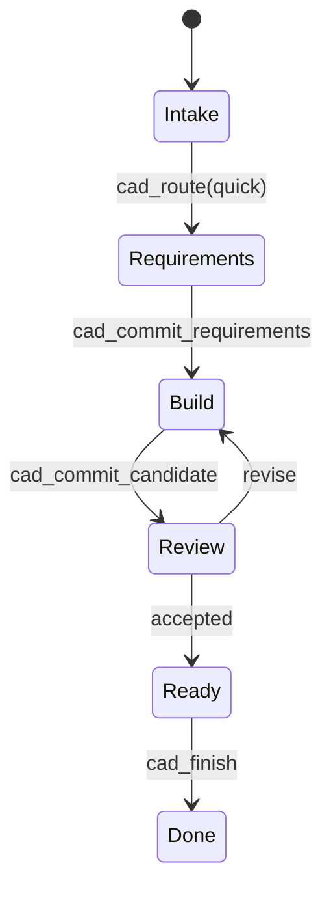

## 17.2 V0 完整运行

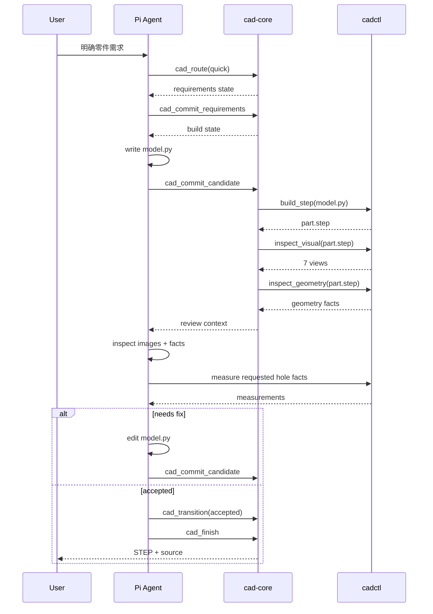

## 17.3 V0 目录

```text
pi-cad/
├── package.json
├── src/
│   ├── extensions/
│   │   ├── core/index.ts
│   │   ├── geometry/index.ts
│   │   └── visual/index.ts
│   ├── workflows/quick.ts
│   ├── prompts/
│   │   ├── invariants.md
│   │   ├── intake.md
│   │   ├── requirements.md
│   │   └── review.md
│   └── shared/
│       ├── state.ts
│       └── protocol.ts
└── python/
    └── cadctl/
```

## 17.4 V0 Acceptance Criteria

V0 必须证明：

1. `/cad` 或 CAD flow 能稳定激活；
2. Agent 必须显式 route；
3. Quick Requirements 可以完成 grilling，也可以在明确任务下零额外提问；
4. Agent 无需手工运行旧 `scripts/step → snapshot → inspect` 链；
5. `cad_commit_candidate` 后 Harness 自动 build + views + geometry；
6. Review 获得的视图对应 current artifact hash；
7. source 改变后旧 evidence 自动 stale；
8. Agent 可以用 targeted measure 工具自行追问几何；
9. Harness 可以阻止非法 transition；
10. 未进入 Ready 时 `cad_finish` 失败；
11. Pi session 重启后 project state 可恢复；
12. 最终交付 source + STEP。

## 17.5 Walking Skeleton 之后的扩展顺序

### V1 — Analyze

增加 read-only guard、baseline auto-inspection、measure/section/frame。

### V2 — Modify

增加 old/new artifact binding、compare_geometry、plan state、evidence invalidation。

### V3 — Greenfield

增加 one-question grilling、Concept/Intent states、dynamic engineering skill loading。

### V4 — Convert / Assembly

增加 occurrence tree、world transforms、matched views、conversion workflow。

### V5 — Release

增加 drawing/simulation/presentation optional plugins 和 workstream state。

不要反过来。先做 Release 会重新制造旧 Skill 的复杂度。

---

# 18. 从旧 `cad-skill` 的迁移策略

## Phase A：冻结旧 Skill

给当前仓库打 tag。以后它是：

- 方法论来源；
- regression corpus；
- capability parity checklist；
- prompt/skill 知识库。

不再继续向总 `SKILL.md` 加流程规则。

## Phase B：先迁 deterministic backend

将现有：

```text
scripts/step
scripts/inspect
scripts/snapshot
scripts/drawing
scripts/simulate
scripts/present
```

整理成稳定 JSON API / Python library。尽量保留成熟的 cadpy 代码，不重写 B-Rep 基础能力。

## Phase C：迁流程，不迁知识

优先迁：

```text
routing
mutation boundary
state transitions
auto build/inspect
artifact versioning
evidence invalidation
finish guards
```

这些才属于 Harness。

## Phase D：把 Markdown 拆回真正的 Skills

例如：

```text
mechanical-design
build123d-modeling
legacy-interpretation
interface-design
assembly-design
manufacturing
drawing-practice
simulation-practice
presentation-practice
```

删除其中所有 “必须先执行 X command，再进入 Y gate” 的流程约束。

## Phase E：用旧 transcripts 做 regression

旧 transcript 不再只评分最终回答是否遵守方法论，而要测试：

- route 是否正确；
- grilling 是否足够；
- 是否真的看了 current artifact；
- mutation boundary 是否硬阻止；
- candidate 是否自动构建；
- evidence 是否版本一致；
- 工具调用是否减少；
- 用户纠错次数是否下降；
- wall-clock 是否下降。

---

# 19. 评估指标

新的主 benchmark 不应再只有 policy compliance。

建议记录：

| 指标 | 含义 |
|---|---|
| time-to-first-valid-artifact | 第一个可读 STEP 的时间 |
| total wall time | 整个任务时间 |
| model tokens | Agent 推理成本 |
| tool calls | orchestration 复杂度 |
| redundant tool calls | 重复浪费 |
| candidate iterations | CAD 收敛次数 |
| user clarification turns | grilling 成本 |
| user correction count | Agent 误解次数 |
| current-version evidence rate | 证据是否绑定最新 artifact |
| mutation violations | diagnose/read-only 是否被突破 |
| workflow rollback count | 架构/意图/局部错误分布 |
| final human acceptance | 真实工程师是否接受结果 |

对比：

```text
bare Pi
old cad-skill
Pi-CAD
CADAM-like visual loop
```

这样才能回答新 Harness 是否真正更快、更可靠，而不是只更复杂。

---

# 20. 非目标与边界

Pi-CAD V1 不追求：

- 自动从任意 STEP 恢复完整设计意图；
- 万能工程 verifier；
- 把机械工程判断塞进 tool backend；
- 多 Agent 组织；
- 自进化 workflow；
- 替代专业 CAE/CAM/PLM；
- 无人类责任的 production approval。

Pi-CAD 只保证：

> **Agent 能在一个可观察、可恢复、被流程约束的机械工程环境中工作，而不再靠记住一整本 Markdown 手册来维持正确流程。**

---

# 21. 最终架构一句话

旧 `cad-skill`：

```text
Agent = Engineer + Workflow + State + Tool Orchestration + QA
```

Pi-CAD：

```text
Pi      = Agent runtime
Agent   = semantic engineering intelligence
Harness = workflow / state / permission / continuation
Tools   = deterministic sensors & actuators
Skills  = engineering knowledge
State   = versioned project process record
```

最终闭环：

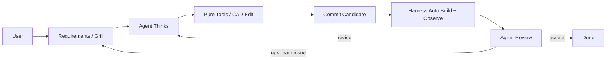

**Tools expose reality. Agent interprets reality. Workflow defines process. Harness enforces workflow. Skills improve reasoning.**

这五句话就是 Pi-CAD 的架构内核。

---

# 参考资料

- `QiuYi111/cad-skill`: `SKILL.md`, `references/design-control.md`, `references/design-records.md`, `references/greenfield-workflow.md`, `references/critics-gates-and-recovery.md`, `references/snapshot-review.md`, `references/release-workflow.md`, `references/engineering-drawings.md`, `references/simulation-quality.md`, `references/presentation-quality.md`, `references/manufacturing-and-delivery.md`.
- `Adam-CAD/CADAM`: `src/server/aiChat.ts`, `src/components/chat/ChatSession.tsx`, `shared/chatAi.ts`, `src/worker/openSCAD.ts`.
- Pi extension / SDK / package documentation in the current Pi repository.
- Matt Pocock `skills`: `grill-me`, `grilling`, `grill-with-docs`; Pi-CAD 只借鉴其需求访谈纪律，不复制其软件工程工作流。
